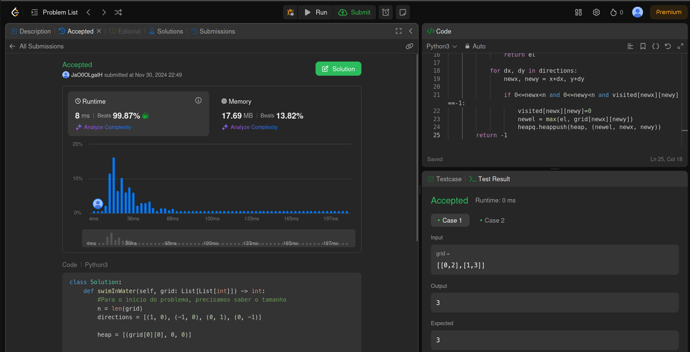
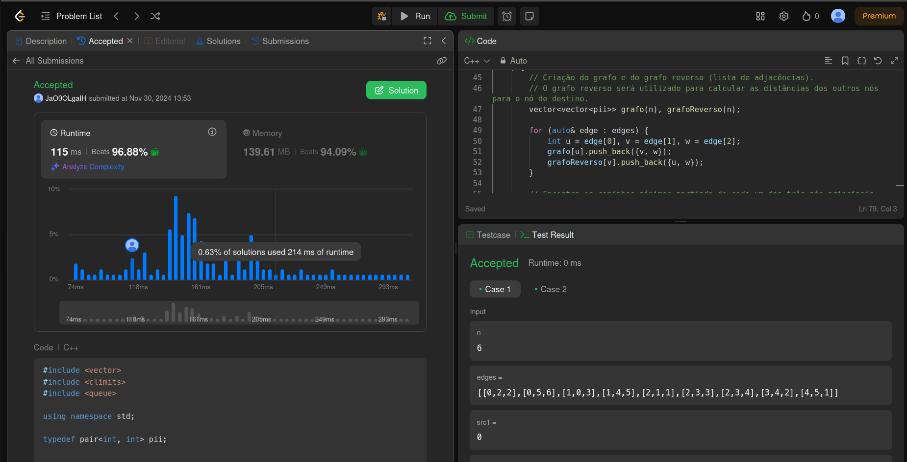
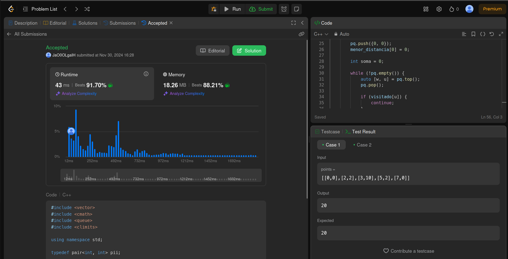
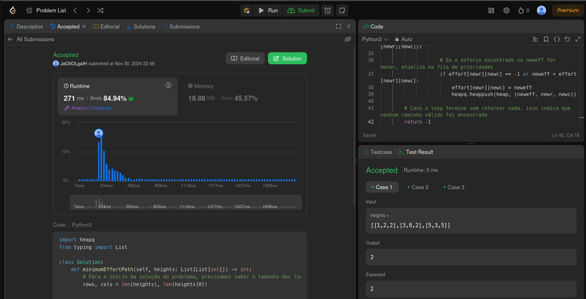

# Leetcode_Problemas

**Número da Lista**: 20 
**Conteúdo da Disciplina**: Grafos 2 

## Alunos

| Matrícula  | Aluno                        |
| ---------- | ---------------------------- |
| 22/1021886 | Cássio Sousa dos Reis        |
| 22/1008267 | Lucas Gama de Araujo Bottino |

## Sobre

Este projeto tem como objetivo a resolução de exercícios da plataforma de juíz online [LeetCode](https://leetcode.com/) sobre o conteúdo de Grafos 2.

## Questões

| Nome                                                                                                                                                    | Dificuldade |
| ------------------------------------------------------------------------------------------------------------------------------------------------------- | ----------- |
| [778. Swim in Rising Water](https://leetcode.com/problems/swim-in-rising-water/description/)                                                            | Difícil     |
| [2203. Minimum Weighted Subgraph With the Required Paths](https://leetcode.com/problems/minimum-weighted-subgraph-with-the-required-paths/description/) | Difícil     |
| [1584. Min Cost to Connect All Points](https://leetcode.com/problems/min-cost-to-connect-all-points/description/)                                       | Média       |
| [1631. Path With Minimum Effort](https://leetcode.com/problems/path-with-minimum-effort/description/)                                                   | Média       |

## Screenshots

### 778. Swim in Rising Water

### 2203. Minimum Weighted Subgraph With the Required Paths

### 1584. Min Cost to Connect All Points

### 1631. Path With Minimum Effort

## Instalação

**Linguagem**: C++ e Python 

## Uso

Para rodar os códigos, primeiro acesse o site do [LeetCode](https://leetcode.com/), faça login e pesquise a questão. Depois, selecione a linguagem correta, copie e cole o código na aba "Code", e clique em "Run" para testar ou "Submit" para enviar a solução.

## Apresentações sobre os exercícios

[Visite aqui a apresentação dos exercícios 1631 e 778](https://youtu.be/cCIk0-t3fWI)
